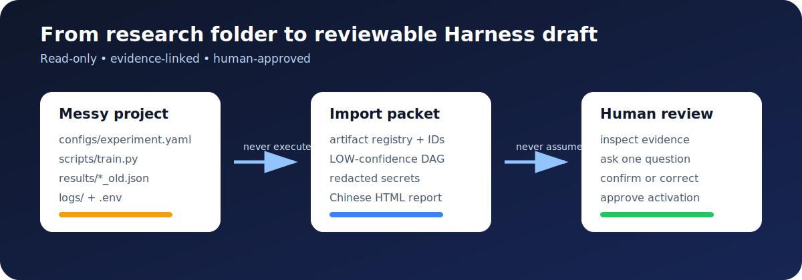

# Research Project Importer

[](https://github.com/emanuelmerino481/research-project-importer/actions/workflows/tests.yml)
[](https://www.python.org/)
[](LICENSE)

[中文说明](README.zh-CN.md)

**Turn an existing scientific project into a reviewable Agent Harness draft—with one command, without executing or modifying the source project.**



Long-running research projects accumulate scripts, configs, checkpoints, old metrics, GPU logs, and undocumented decisions. An Agent can inventory these files, but it must not silently convert guesses into scientific facts. Research Project Importer creates an evidence-linked draft and makes every unresolved scientific decision explicit.

## See the complete demo

The repository includes a deliberately incomplete synthetic research project containing conflicting seeds, an unfrozen metric, an ambiguous “best” result, a GPU log, and a secret-like file.

**[Explore the before/after demo →](examples/README.md)**

| Before: observed files | After: reviewable evidence |
| --- | --- |
| `configs/experiment.yaml` | [`project-manifest.yaml`](examples/generated-import-packet/project-manifest.yaml) |
| `scripts/{prepare,train,evaluate,report}.py` | [`artifact-registry.yaml`](examples/generated-import-packet/artifact-registry.yaml) |
| conflicting `results/*.json` | [`task-dag.yaml`](examples/generated-import-packet/task-dag.yaml) |
| GPU log without utilization | [`review-session.yaml`](examples/generated-import-packet/review-session.yaml) |
| `.env` | redacted metadata, no content or hash |

The generated DAG remains `LOW` confidence. The review session asks one question at a time, shows evidence IDs and an Agent recommendation, then waits for a human verdict before continuing.

## Quick start

```bash
git clone https://github.com/emanuelmerino481/research-project-importer.git
cd research-project-importer
python -m pip install -e .

research-project-import /path/to/existing-project \
  --project-id MY-PROJECT \
  --output /path/to/imports/MY-PROJECT

python skills/research-project-importer/scripts/validate_import.py \
  /path/to/imports/MY-PROJECT
```

The packet contains:

- `project-manifest.yaml` — scan boundary, languages, Git metadata, and category counts;
- `artifact-registry.yaml` — stable artifact IDs, sizes, redaction state, and bounded hashes;
- `task-dag.yaml` — low-confidence prepare/train/infer/evaluate/report candidates;
- `review-session.yaml` — evidence, recommended answers, dependencies, and human verdicts;
- `bootstrap.md` — cold-start context for a new Agent session;
- `import-summary.json` and a Chinese `import-report.html`.

## Safety model

- Never executes source project code.
- Never modifies or reorganizes the source project.
- Does not follow symlinks or traverse Git metadata, environments, caches, WandB, or MLflow stores.
- Never reads or hashes secret-like files.
- Does not hash large datasets or checkpoints during reconnaissance.
- Removes credentials and query parameters from HTTP Git remotes.
- Refuses to place output inside the source directory.
- Keeps the packet in `DRAFT_HUMAN_REVIEW` until required human decisions are resolved.

This is reconnaissance software, not a sandbox and not scientific verification. Review generated paths before sharing a packet.

## Codex Skill

`skills/research-project-importer/` is an installable Codex Skill. It requires evidence-first, one-question-at-a-time review and prevents an Agent from activating tasks before explicit human approval.

## Why the demo is synthetic

Its structure reflects common research layouts documented by projects such as [Cookiecutter Data Science](https://github.com/drivendataorg/cookiecutter-data-science), while all demo content is original. This keeps the example realistic, reproducible, small, and free of third-party dataset or research-result claims.

## Status and contributing

The project is an early public release. Useful next steps include richer dependency evidence, additional language detectors, packet schema versioning, and integrations with existing Harness frameworks. See [CONTRIBUTING.md](CONTRIBUTING.md) before opening a pull request. Security-sensitive reports belong in [SECURITY.md](SECURITY.md), not a public issue.

## Acknowledgements and license

The human-review interaction was inspired by the `grilling`, `grill-me`, and `grill-with-docs` skills in [mattpocock/skills](https://github.com/mattpocock/skills). No upstream implementation code was copied; the pinned revision and adaptation boundary are documented in [docs/SOURCES.md](docs/SOURCES.md).

Licensed under [Apache-2.0](LICENSE).
