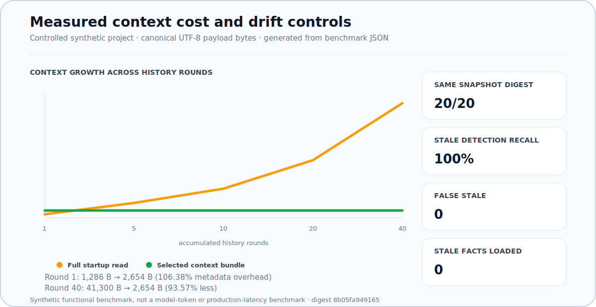
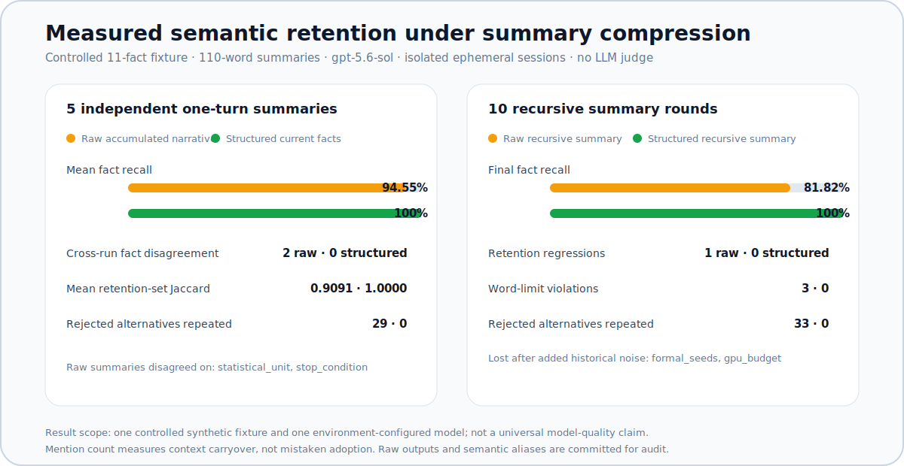

<picture>
  <source media="(prefers-color-scheme: dark)" srcset="docs/hero-dark.svg">
  <source media="(prefers-color-scheme: light)" srcset="docs/hero-light.svg">
  
</picture>

[English](README.md)

## 导入旧项目，不导入它的含糊判断

**用一条命令，把长期靠 IDE、脚本和服务器人工维护的科研项目转换成可审核的 Agent Harness 草案；不执行、不修改源项目。**


长期科研项目通常散落着配置、训练脚本、checkpoint、旧指标、GPU 日志和没有写下来的决策。Agent 可以盘点它们，但不能把文件名和历史结果直接升级为科研事实。本工具把观察到的证据、低置信度推断和必须由人决定的问题明确分开。

## 💌 写给来到这里的你

嗨，欢迎来到这里！👋

我现在大一，也才刚刚开始接触 AI 编程、Agent 和 Harness。很多东西还在边学边做，并不是什么经验丰富的大佬。最开始，我只是用 Trae 一步一步做自己已经开起来的项目。项目越做越长，脚本、配置、实验结果、GPU 记录，还有各种“以后再整理”的想法，也就慢慢散得到处都是。🌱💻

我当时很想让项目真正跑成一个 Loop：Agent 能读懂当前项目，做一次有边界的修改，运行或者验证，保存证据，给我汇报，然后再继续下一轮。听起来好像挺自然，对吧？🔁🧪

但真的开始做以后，我发现：想把一个**已经开工、已经有历史包袱的项目**接进 Loop，貌似比从零搭一个漂亮 Demo 难多了。模型找到了 `train.py`，不代表它知道哪个才是正式入口；看见最大的 accuracy，不代表它知道主指标；读过文件，也不等于真的理解实验。对话一断、上下文一丢，很多之前讲清楚的东西又得重新来一遍。😵‍💫

所以我就一点一点弄出了这个东西。它比较对口的人，可能不是所有开发者，而是像我一样的这部分人：项目已经在跑了，文件也已经有点乱了，不太可能全部推倒重来，但又真的想把 Agent、Harness 和循环工作流接进来。也包括做课程、科研、个人实验，或者维护长期脚本的同学。🧰🤖📚

这是我第一次把这样的东西公开出来，现在肯定还不完美。如果它碰巧也解决了你的问题，欢迎拿真实项目试试看；哪里不对就提 Issue，觉得我的理解有问题也请直接纠正我。能收到一个 Star 当然会很开心 ⭐，但如果它真的帮某个旧项目顺利走进 Loop，那就更酷了。❤️

也很感谢我的本科生导师一路上的帮助。他也很欢迎对 **生物 + AI** 交叉方向感兴趣的同学来交流。🧬🤖 如果你真的对这个方向感到好奇，想进一步了解或者聊聊，可以通过邮箱联系他：[dacheng2023@126.com](mailto:dacheng2023@126.com)。📮

谢谢你愿意看到这里，也欢迎和我一起把它慢慢做得更好！🚀

— [@emanuelmerino481](https://github.com/emanuelmerino481)

## 完整 Demo

仓库包含一个原创的典型半成品科研项目：两个不一致的 seed、没有冻结的主指标、来源不明的“最佳结果”、缺少利用率的 GPU 日志，以及必须脱敏的 `.env`。

**[查看导入前后完整 Demo →](examples/README.md)**

导入后会生成：

- [`project-manifest.yaml`](examples/generated-import-packet/project-manifest.yaml)：扫描范围和项目概况；
- [`artifact-registry.yaml`](examples/generated-import-packet/artifact-registry.yaml)：稳定证据 ID、受控 hash 和脱敏状态；
- [`code-graph.json`](examples/generated-import-packet/code-graph.json)：Python 静态结构、可解析的结构边、未解析调用，以及增量 stale/removed ID；
- `knowledge-baseline.yaml`：结构化事实、证据快照和 `CURRENT`/`STALE`/`UNVERIFIED` 有效性；
- [`task-dag.yaml`](examples/generated-import-packet/task-dag.yaml)：低置信度任务与依赖候选；
- [`review-session.yaml`](examples/generated-import-packet/review-session.yaml)：推荐答案、证据、人工裁决和问题依赖；
- [`import-report.html`](examples/generated-import-packet/import-report.html)：中文人工审核页面。

## 多项目 Demo 矩阵

导入器已实际跑过 **6 个受控边界项目和 4 个锁定 commit 的公开 GitHub 仓库快照**。10 个导入包全部通过 `IMPORT_PACKET_VALID`，每次导入都报告 `source_mutated: false`。汇总数字覆盖全部 10 行，而不只是 4 个公开仓库：在各 Demo 的最终快照上，共观察到 **186 个文件、72 个 Python 文件、391 个代码节点和 593 条结构边**。公开仓库按精确 commit 下载，记录了压缩包 SHA-256，并确认导入前后整棵源码树 digest 一致。没有安装依赖，也没有执行仓库代码。

| 公开仓库快照 | 文件 / Python | CodeGraph 节点 / 边 | 解析错误 | 未变化时第二次导入 |
| --- | ---: | ---: | ---: | ---: |
| [`karpathy/micrograd@c911406`](https://github.com/karpathy/micrograd/commit/c911406e5ace8742e5841a7e0df113ecb5d54685) | 13 / 5 | 45 / 58 | 0 | 0 解析 / 5 复用 |
| [`karpathy/nanoGPT@3adf61e`](https://github.com/karpathy/nanoGPT/commit/3adf61e154c3fe3fca428ad6bc3818b27a3b8291) | 26 / 15 | 45 / 64 | 0 | 0 解析 / 15 复用 |
| [`drivendataorg/cookiecutter-data-science@0f6b163`](https://github.com/drivendataorg/cookiecutter-data-science/commit/0f6b163cdbe3918a2c65ab57ad9fefda93976d9e) | 82 / 22 | 57 / 76 | 6 | 0 解析 / 22 复用 |
| [`lucidrains/alphafold2@931466e`](https://github.com/lucidrains/alphafold2/commit/931466e487e1be87d1182b17ed4ecfac9e70948d) | 42 / 18 | 222 / 381 | 0 | 0 解析 / 18 复用 |

Cookiecutter 的 6 个解析错误来自保留的 Jinja Python 模板；这里验证的是“解析错误会显式记录且不中断导入”，不是宣称所有文件都能得到干净 AST。这里的 `PASS` 表示该场景的所有断言通过且导入包被校验器接受；如果预期错误已被明确记录，仍可存在解析错误。在证据偏移和删除两行中，是测试运行器有意在两次导入之间修改夹具；`source_mutated: false` 表示导入器本身没有做这个修改。

| 受控 Demo | 覆盖边界 | 实测结果 |
| --- | --- | --- |
| 不完整科研项目 | 冲突产物、疑似秘密文件、有界上下文 | 秘密已脱敏；选中 2 条事实、2 个代码节点和 1 条边 |
| Python 包别名 | 相对导入、别名、类、方法和调用 | 成功解析 `IMPORTS` 和 `CALLS`；解析错误 0 |
| 破损与动态 Python | 语法错误和 `factory()()` | 记录 1 个语法错误和动态调用，导入未中断 |
| 秘密与大小边界 | `.env`、hash 上限、AST 大小上限 | 秘密值未泄露；超限任务事实标记为 `UNVERIFIED` |
| 证据偏移 | 人工事实引用旧 artifact hash | 2 个图节点标记失效；过期人工事实被排除 |
| 证据删除 | 两个 Python 文件中删除一个 | 报告移除 1 个 artifact 和 2 个图节点 |

可审查[Demo 矩阵完整结果](benchmarks/demo-matrix-results.json)和[可复现运行器](benchmarks/run_demo_matrix.py)。这些是兼容性与安全边界演示，不代表导入器已证明候选工作流或科学结论正确。

## 实测受控基准

下面两张图由仓库内的基准 JSON 自动生成，不是手填的宣传数字。



上下文选择存在真实的交叉成本：历史只有 1 轮时，由于携带证据元数据，bundle 比完整读取短 startup **大 106.38%**；历史积累到 5、10、20、40 轮时，实测 payload 分别减少 **50.76%、74.77%、87.23%、93.57%**。在受控失效夹具上，相同快照 bundle digest 20/20 一致，过期证据召回率 100%，错误失效 0，进入 bundle 的过期事实为 0。



在一个包含 11 个正式事实的受控夹具、110 词限制和相互隔离的 `gpt-5.6-sol` 临时会话下：

- 对同一份完整原始历史做 5 次独立单轮总结，平均事实保留率为 94.55%，两个字段出现跨会话选择分歧；结构化当前事实为 100%，字段分歧为 0；
- 连续做 10 轮递归摘要后，原始摘要最终保留 81.82%，并丢失 `formal_seeds` 和 `gpu_budget`；结构化序列保持 100%，没有发生事实回退。

这只是一个合成夹具和一个当前配置模型下的证据，不代表普遍模型质量或生产 token 成本。上下文成本采用规范化 UTF-8 payload 字节，而不是模型 token。可审查[上下文结果](benchmarks/context-benchmark-results.json)、[语义结果](benchmarks/semantic-benchmark-results.json)、[金标准与同义规则](benchmarks/semantic-fixture.json)、[原始模型输出](benchmarks/semantic-runs/)和[基准方法](benchmarks/README.md)。

## 实现校验

当前实现还通过了自动化样例、仓库内合成 Demo，以及对本仓库自身的只读导入验证。

| 验证项 | 结果 |
| --- | --- |
| 自动化测试 | **28/28 通过** |
| 合成 Demo 导入包 | **`IMPORT_PACKET_VALID`** |
| 多项目 Demo 矩阵 | **10/10 个导入包有效；4 个锁定 commit 的公开仓库** |
| 本仓库自导入 | **19 个 Python 文件 → 188 个节点、418 条结构边** |
| 未变化时第二次导入 | **0 个文件重新解析、复用 19 个图分片** |

可查看 [CodeGraph 测试](tests/test_codegraph.py)、[上下文测试](tests/test_context.py)、[导入包校验器](skills/loop-importer/scripts/validate_import.py)和[生成的 Demo 图](examples/generated-import-packet/code-graph.json)复核证据。

这些能力只是 [Issue #2](https://github.com/emanuelmerino481/loop-importer/issues/2) 与 [Issue #3](https://github.com/emanuelmerino481/loop-importer/issues/3) 的部分基础实现，并不代表问题已经关闭。目前证据有效性仍以整文件 hash 为主，上下文选择仍是词法检索；值级 locator、持久化人工裁决事件、冲突传播和交接总结仍待实现。

## 快速开始

```bash
git clone https://github.com/emanuelmerino481/loop-importer.git
cd loop-importer
python -m pip install -e .

loop-import /path/to/existing-project \
  --project-id MY-PROJECT \
  --output /path/to/imports/MY-PROJECT

python skills/loop-importer/scripts/validate_import.py \
  /path/to/imports/MY-PROJECT

loop-context /path/to/imports/MY-PROJECT \
  --query "训练入口和主指标" \
  --output /path/to/context-bundle.json
```

## 人工审核方式

审核不是一次丢出一串问题。Agent 必须先检查证据候选，每次只展示一个问题和推荐答案，等待研究者选择确认、修正、拒绝推断或要求补证。所有必答项解决并得到人工批准前，状态保持 `DRAFT_HUMAN_REVIEW`，不得启动正式实验。

## 安全边界

- 不执行或修改源项目代码；
- 不跟随符号链接，不遍历 Git、虚拟环境、缓存、WandB 或 MLflow；
- 不读取或 hash 疑似秘密文件；
- 只用 Python 标准库 AST 建图，不 import 或执行源项目模块；
- 仅当路径、artifact ID 和 SHA-256 都未变化时复用图分片；
- 侦察阶段不 hash 大数据和 checkpoint；
- 清除 HTTP Git remote 中的账号、密码和 query；
- 拒绝把导入结果写进源项目内部。

它是项目侦察和人工审核工具，不是沙箱，也不自动证明实验正确。公开导入包前仍需检查其中的路径。

Demo 结构参考 [Cookiecutter Data Science](https://github.com/drivendataorg/cookiecutter-data-science) 等常见科研项目布局，但全部示例内容均为原创合成数据，不包含第三方科研结果。问答审核来源与采用边界见 [docs/SOURCES.md](docs/SOURCES.md)。

项目采用 [Apache-2.0](LICENSE)。参与贡献请阅读 [CONTRIBUTING.md](CONTRIBUTING.md)。
